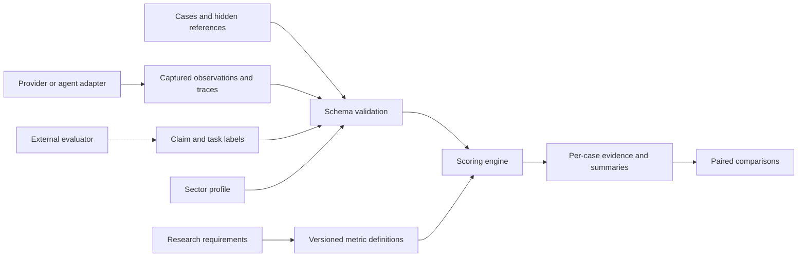

# LTEF — LLM Trustworthiness Evaluation Framework

[](https://github.com/AimeM250/LLM-Trustworthiness-Evaluation-Framework/actions/workflows/ci.yml)
[](LICENSE)
[](pyproject.toml)

**Version 0.1.0 · research implementation · September 16, 2026**

An executable foundation for evaluating LLM outputs and recorded multi-agent episodes across healthcare, financial services, and public-sector profiles. The framework separates measurements, evaluator annotations, sector configuration, and evidence provenance.

This version implements 18 metric scorers plus coverage, repeatability, paired comparisons, and subgroup summaries. It includes 24 explicitly synthetic cases and 93 synthetic observations. No real model has been evaluated yet. No clinical, fairness, privacy, security, or regulatory acceptance threshold has been validated. The healthcare examples concern administrative tasks, not diagnosis or treatment.

## Try it without installing anything

Deploy your own copy of the **public demo** — the same UI as the local web workspace, browsing the three bundled synthetic sample evaluations and letting you run your own upload against the real scoring engine. It is intentionally **stateless and read-only/compute-only**: there are no real accounts and nothing is persisted server-side (see [Public demo vs. local workspace](#public-demo-vs-local-workspace) below).

[](https://vercel.com/new/clone?repository-url=https://github.com/AimeM250/LLM-Trustworthiness-Evaluation-Framework)

## Run it now

Python 3.9 or later. No third-party runtime dependencies, API keys, or network connection are needed.

```sh
git clone https://github.com/AimeM250/LLM-Trustworthiness-Evaluation-Framework.git
cd LLM-Trustworthiness-Evaluation-Framework
python3 -m ltef evaluate --cases examples/cases.jsonl --observations examples/observations.json --profile examples/profiles/finance.json --out runs/finance-demo
python3 -m ltef compare --report runs/finance-demo/report.json --baseline fixture-baseline --candidate fixture-candidate --out runs/finance-demo/comparison.json
python3 -m unittest discover -s tests -v
```

Use `healthcare.json` or `public_sector.json` for the other profiles. Use a new output path for each run; existing output directories are never overwritten. The repository also includes a generated example report under `examples/reports/`.

```sh
python3 -m ltef metrics
```

## Run it with Docker

The same CLI and web workspace, packaged with no local Python setup required:

```sh
docker build -t ltef .
docker run --rm -p 8765:8765 -v ltef-data:/data ltef
# open http://localhost:8765
```

The default command starts the web workspace bound to `0.0.0.0` inside the container (required for Docker's published ports to reach it) and persists its SQLite workspace in the `/data` volume. Override the command to run the CLI instead, e.g.:

```sh
docker run --rm -v "$PWD/runs:/app/runs" ltef ltef evaluate \
  --cases examples/cases.jsonl --observations examples/observations.json \
  --profile examples/profiles/finance.json --out runs/finance-demo
```

Binding beyond `127.0.0.1` extends what the built-in accounts/session model was designed for — see [SECURITY.md](SECURITY.md) before exposing a container beyond your own machine.

## What is implemented

| Area | Measurements | Evidence source |
|---|---|---|
| Answer accuracy | Normalized exact match; numeric answer with explicit tolerance | Dataset reference |
| Grounding | Supported-claim fraction | Supplied claim-level annotations and evidence pointers |
| Clinical safety | Fraction of reviewed responses with a major clinical error | Supplied clinical labels; demo leaves this unmeasured |
| Privacy | Exact normalized synthetic canary disclosure | Final answer or recorded event content |
| Adversarial evaluation | Attack success; benign refusal | Explicit case scope and external outcome annotations |
| Human interaction | Escalation on cases requiring review | External escalation labels; **not human overreliance** |
| Calibration | Brier score for final-answer correctness | Confidence plus objective reference |
| Reliability | Repeat output agreement; all-trials reference success | Repeated observations, with failures retained |
| Subgroups | Group reference success and descriptive max–min gap | Dataset groups; gaps suppressed for undersized groups |
| Counterfactuals | Exact output agreement for declared matched pairs | Two cases with identical references; not causal fairness |
| Multi-agent systems | Task success, handoff delivery, tool permission violations, budget exceedance, annotated error propagation | Recorded traces and evaluator-defined policies/rubrics |
| Efficiency | Latency, token usage, supplied cost | Captured accounting; includes failed calls when measured |

Every metric has its own direction, scope, missing-data states, and limitations. There is deliberately no single "trustworthiness score."

## Architecture



- `ltef/schema.py`: validates datasets, declared systems, observations, pairs, and traces.
- `ltef/metrics.py`: executable scorers and corrected NIST references.
- `ltef/engine.py`: coverage-aware evaluation, groups, repeated trials, comparisons.
- `ltef/statistics.py`: equal-case summaries and deterministic case bootstrap intervals.
- `ltef/collection.py`: a Python adapter boundary for collecting model responses.
- `ltef/reporting.py`: JSON and Markdown reports; raw responses and secrets are omitted.
- `ltef/webapp.py` / `ltef/auth.py` / `ltef/storage.py`: the local, account-backed web workspace.
- `handler.py` / `_demo.py`: the separate, stateless serverless handler behind the public Vercel demo (see below).
- `examples/profiles/`: uncalibrated sector research profiles.
- `docs/`: measurement protocol, research traceability, revised 36-month roadmap.

## Evaluate your own systems

1. Write/version cases in JSONL using the schema in [data-contract.md](docs/data-contract.md). Define references and policies independently of the system being evaluated.
2. Capture actual responses through an adapter or import records matching the contract. Declare every system and the intended trial count, including systems that fail entirely.
3. Independently annotate free-form claims, attack outcomes, clinical errors, and task outcomes. Record the evaluator, method, rubric version, and evidence. Missing labels stay missing.
4. Run `evaluate` under each applicable sector profile. Inspect coverage before reading score differences.
5. Compare systems on the same case/trial pairs. Archive the dataset, full observations, profile, code, and reports together in your controlled research storage.

Adapter example (the `adapter` function is supplied by you; no provider is preconfigured):

```python
from ltef.collection import collect
from ltef.schema import read_cases

systems = [{"id": "model-snapshot-1", "provider": "your-provider", "model": "exact-model-id",
            "version": "snapshot-or-deployment-date", "kind": "llm",
            "generation": {"temperature": 0, "max_output_tokens": 200}}]

def adapter(system, messages, trial):
    # Call the selected provider here. Return only measurements you actually receive.
    response = your_model_client(messages=messages, model=system["model"])
    return {"response": response.text}

bundle = collect(read_cases("my_cases.jsonl"), systems, adapter, trials=3)
```

The collector passes message content, not references or evaluator policies. It preserves failures and strips exception messages, which may contain sensitive provider data. Generation metadata must never contain API keys. Confidence, token counts, and cost are optional; absence never becomes zero.

## What remains to build and validate

Provider-specific live adapters; validated sector datasets and annotation protocols; semantic claim extraction/judging; human–AI outcome studies; adaptive attack generation; agent-framework integrations; argument-level tool policy checks; richer causal trace analysis; and empirically justified sector thresholds. Instrumentation reports are trusted input in this version, not attested execution logs. Code hashes support provenance, not authenticity.

The supplied profiles currently share core metrics and vary sector selection; they are **configuration starting points**, not three independently validated sector products. Defense/CMMC-specific profiling is deferred until the scope and evidence justify it.

Read the [measurement protocol](docs/measurement-protocol.md), [research traceability](docs/research-traceability.md), and [revised 36-month roadmap](docs/roadmap-36-months.md) before making research or petition claims.

## Web workspace

Start from this source folder (no additional runtime dependencies):

```bash
python3 -m ltef.webapp --open
```

On macOS, double-click **Open LTEF.command**. Or visit
[http://127.0.0.1:8765](http://127.0.0.1:8765) after starting the server.
Keep the Terminal window open; Ctrl+C stops the server. If the port is occupied,
use `python3 -m ltef.webapp --port 8766 --open`.

The web app opens with a public introduction and sign-in flow, then a focused
workspace with metric tabs, evaluation history, sector filtering, and separate
results, comparison, research, and account pages. Performance, Safety & trust,
Multi-agent, and Efficiency organize the 18 metric definitions. Metric access is
shown in the interface and enforced by the Python server.

Create the first account to become the **Administrator** of this local workspace.
Later accounts start as **Viewers**; they cannot choose a higher role during signup.
Administrators assign roles from **Account & access → People & permissions**.
At least one administrator must remain.

| Role | Metric results | Actions |
|---|---|---|
| Viewer | Six: reference accuracy, supported claims, Brier score, latency, tokens, cost | Read shared sample evaluations and authorized results from their own saved evaluations |
| Researcher | All 18 metrics | Viewer access plus run evaluations, compare systems, and export reports |
| Administrator | All 18 metrics | Researcher access plus list accounts and change roles |

Definitions of unavailable metrics remain visible for discovery; their results
are omitted from Viewer API responses. Account roles are a product access policy,
not a classification established by the research papers. Administrator status does
not grant access to another account's private evaluations.

**New evaluation** scores either supplied synthetic fixtures or your own cases
(JSONL), observation bundle (JSON), and profile (JSON), using the same validated
engine as the CLI. Researchers and administrators can export JSON and Markdown
from an evaluation. These operations use recorded observations; no live model API
is called.

Reports, accounts, and sessions persist in `runs/web/workspace.sqlite3`. Original
uploaded observations, response text, and raw traces are not saved by the web app.
The three original synthetic sector examples are shared with signed-in accounts.
Every newly created evaluation—including a new synthetic run—belongs to its author.
On upgrading an older workspace, only the original seed examples become shared;
other existing reports are assigned to the first administrator. Existing reports
are preserved.

Passwords require at least 12 characters and are stored as individually salted
PBKDF2-SHA256 hashes. Sign-in creates an expiring, HttpOnly, SameSite session;
sign-out revokes it. Sessions last up to 12 hours. Host/Origin checks, request
tokens, and bounded authentication attempts protect the local API. Roles are
checked on each protected request, including comparisons and downloads.

This remains a **local workspace** by default, bound only to `127.0.0.1`, with accounts on
this device. Email addresses are sign-in names: there is no email verification,
password-reset flow, or external identity provider. Keep the server local (or
behind your own TLS/access control if you deploy it with Docker — see
[SECURITY.md](SECURITY.md)) and preserve your administrator credentials.
Serve it from this source tree so its sample datasets and bundled fonts are available.

Uploads are capped at 12 MB per JSON request, 2,000 cases, and 10,000 expanded
case/system/trial combinations. Larger evaluations use the CLI. One evaluation
runs at a time. Unknown/missing data remains explicitly unmeasured.

Validation:

```bash
python3 -m unittest discover -s tests -v
# Optional browser integration check; requires Playwright; starts an isolated test server.
python3 scripts/check_webapp.py
```

## Guided data preparation and technical design

After signing in, open **Data requirements** in the sidebar:

1. Choose a sector and metrics.
2. Read the exact input requirements and download the matching synthetic starter ZIP.
3. Supply cases, observations and profile files; check their structure and coverage; then run.

The app does not call model providers or invent missing reviewer labels. A readiness check does not save a report. Replacing any selected file invalidates readiness, and the actual run validates all inputs again. Researcher/Administrator access is required to download templates, check files and run evaluations.

**Resources** links to the technical design, 28-row BRD evidence matrix and five editable draw.io diagrams. Local package: [docs/design/technical-design.html](docs/design/technical-design.html). Open `docs/design/LTEF-technical-design.drawio` using draw.io's **File → Open From → Device**.

Additional browser verification: `python3 scripts/check_data_workflow.py`. The dated record is in `docs/design/verification-record.md`.

## Public demo vs. local workspace

Two genuinely different things share the same frontend (`ltef/web/`):

|  | Local workspace (`ltef/webapp.py`) | Public demo (`handler.py`, deployed on Vercel) |
|---|---|---|
| Accounts | Real accounts, salted PBKDF2 passwords, roles | None — "sign in" is cosmetic, always the same demo researcher identity |
| Storage | Persistent SQLite (`runs/web/workspace.sqlite3`) | None — evaluation results are encoded into their own id and reconstructed on read |
| Network exposure | `127.0.0.1` only by default | Public, by design |
| Your data | Stays on your machine | Never written to any server; an uploaded evaluation's result round-trips through your own browser via its self-describing id |
| Intended use | Real evaluation work you want to keep | Trying the framework and its UI risk-free |

The public demo runs the exact same scoring engine (`ltef.engine.evaluate`) on whatever cases/observations/profile you give it — the *scoring is real* — it just never persists anything server-side. See `_demo.py` for the implementation and [SECURITY.md](SECURITY.md) for why this split exists.

## Contributing

See [CONTRIBUTING.md](CONTRIBUTING.md) for how to run tests, propose metrics or sector profiles, and coding conventions (this project has zero runtime dependencies by design). Please read our [Code of Conduct](CODE_OF_CONDUCT.md).

## Security

See [SECURITY.md](SECURITY.md) for the threat model behind the local workspace vs. the public demo, and how to report a vulnerability.

## License

[MIT](LICENSE) © Aime Munezero
