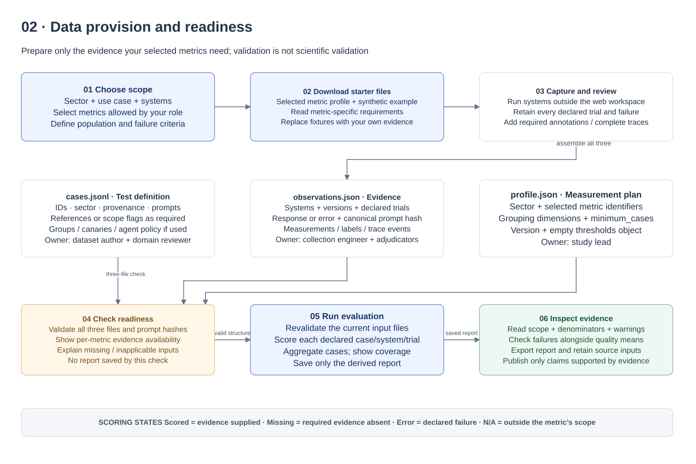
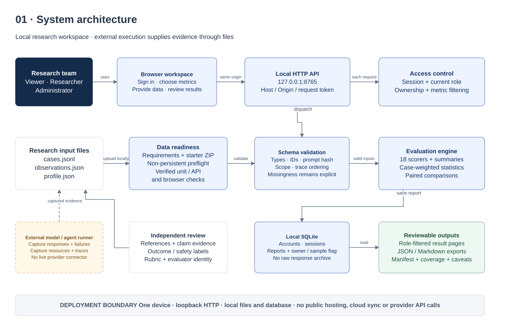
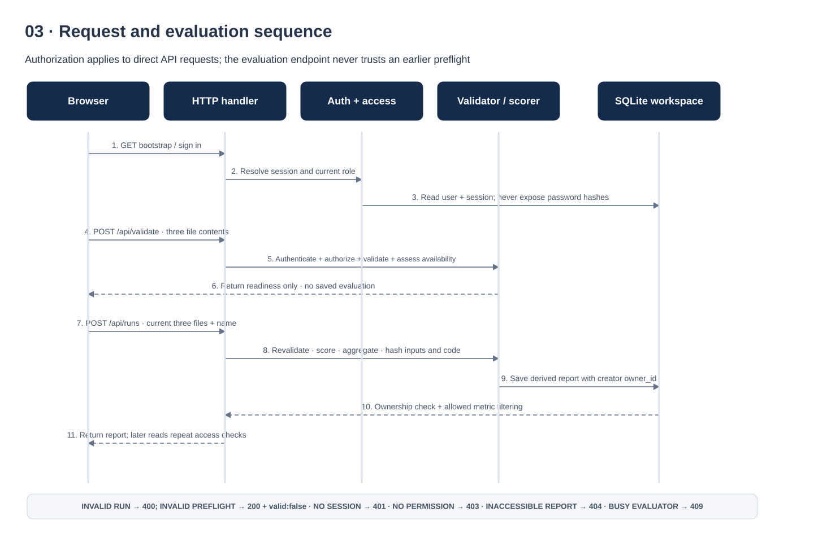
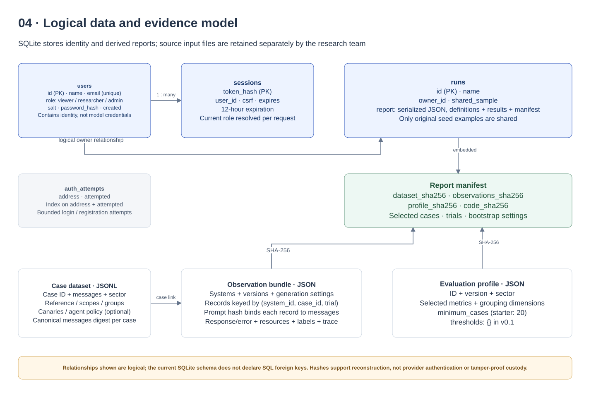
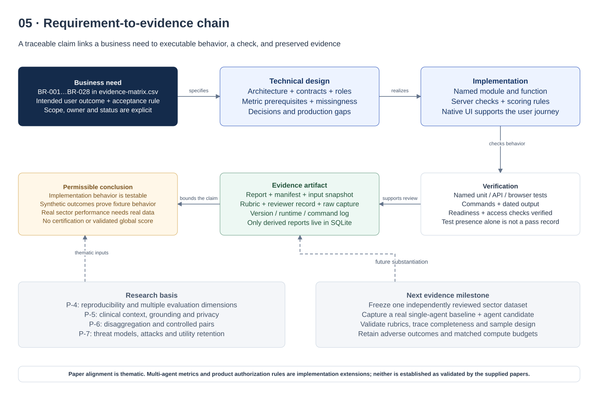

# LTEF technical design and implementation evidence

**Version:** 1.0 design review · **Date:** September 20, 2026 · **Deployment:** local research workspace

LTEF turns a defined evaluation plan and captured LLM or multi-agent evidence into reproducible, inspectable measurements. This document organizes what a research team must provide, how the application processes it, and which business requirements have implementation evidence.

The main deliverable is a usable evidence chain: **business need → acceptance criterion → implementation → verification → retained artifact → supported claim**. The complete row-level mapping is in `evidence-matrix.csv` and the appendix of the HTML edition. Five editable diagrams are supplied in `LTEF-technical-design.drawio`; SVG previews are embedded in the HTML document.

> Current boundary: the evaluator, local accounts, report storage and role controls exist. Data requirements, selected-metric starter templates and nonpersistent readiness checks are implemented and covered by unit/API and browser verification in this revision. Synthetic examples demonstrate software behavior; they are not measured provider or sector performance.

## 1. Business requirements and success criteria

### Problem and intended users

An evaluator should be able to understand the evidence needed for a metric before running an evaluation. A missing annotation should lead to a clear data request, and an absent trace should never be interpreted as a safe agent. Results must remain tied to their cases, configuration, scoring implementation and ownership.

The **study lead** sets the use case, population, profile and interpretation rules. The **dataset author** supplies prompts and reference answers. The **collection engineer** captures model outputs, failures, resource measurements and agent events. The **domain adjudicator** supplies reviewed claims, outcomes and safety labels. The **workspace administrator** manages local access. These research responsibilities are separate from application roles; a Researcher account does not establish clinical expertise or annotation independence.

### Release acceptance

1. A signed-in user can identify accessible metrics and see the specific input fields needed for each one.
2. A Researcher or Administrator can obtain a usable three-file starter pack, provide their own evidence, check it, and run an evaluation.
3. Invalid input produces an actionable error and creates no report. Readiness checks create no evaluation records.
4. Reports distinguish scored, missing, error and inapplicable observations; coverage and denominators accompany values.
5. Authorization is enforced on direct API requests, not only through hidden interface controls.
6. Every saved result includes configuration and content hashes. Source input retention remains an explicit research-team responsibility.
7. A reviewer can follow each requirement to source code, a named check, an evidence artifact and a remaining limitation.

### Scope and nonfunctional expectations

| Area | Current design target | Observable acceptance / limit |
|---|---|---|
| Sectors | Finance, healthcare, public sector | Profiles select cases by sector; these labels do not establish sector validity. |
| Systems | LLM and multi-agent declarations | Versioned system identity; all declared trial slots remain in accounting. |
| Usability | Guided requirements before evaluation | Choose scope, prepare files, check evidence, then inspect results. Detailed metric rules remain available. |
| Reproducibility | Canonical input hashes and implementation hash | Re-evaluation can use retained original files and the matching Python implementation. |
| Privacy | Local processing and minimal saved reports | Raw responses, canary strings, traces and reviewer evidence text are omitted from derived reports. User-supplied metadata can still contain sensitive information. |
| Performance | Bounded synchronous local execution | Web requests: 12 MiB body cap, 2,000 cases, 10,000 case × system × trial combinations. No production throughput or latency SLO has been established. |
| Reliability | Validate before save; preserve missingness | Invalid evaluations create no run. The application does not provide a job queue, distributed recovery or backup automation. |
| Accessibility | Responsive layout and keyboard navigation | Browser checks exercise desktop/mobile navigation and dialog behavior. Formal accessibility conformance has not been assessed. |

## 2. Simple data provision guide

### The three things to provide

| File | Plain-language purpose | Always required | Added when the chosen metric needs it |
|---|---|---|---|
| `cases.jsonl` | What should the systems be tested on? | One JSON object per line: schema version, unique case ID, sector, source, synthetic flag and nonempty messages. | Reference answers, attack/benign/escalation flags, group labels, controlled pairs, synthetic canaries, agent policy. |
| `observations.json` | What actually happened? | Schema version, declared systems, trial count and record list. Each supplied record identifies system, case, trial, prompt hash, provenance and success/error status. | Response, timing, tokens, cost, confidence, reviewed annotations and complete agent traces. |
| `profile.json` | Which measurements should LTEF calculate? | Schema version, profile ID/version, sector, selected metrics, minimum case count, grouping dimensions and `thresholds: {}`. | Appropriate selected metrics and grouping dimensions for the study. Decision thresholds are not supported in v0.1. |

**Start small:** choose one concrete use case and a few applicable metrics. Download the starter files, inspect the synthetic example, and replace it with your actual cases and captured evidence. Keep synthetic and captured provenance truthful; do not relabel fixture answers as real model output. The starter pack is a format example, not a representative benchmark.

**Collect outside LTEF:** the web application evaluates supplied observations. It does not currently call model providers or execute agent tools. The Python `collection.collect` function offers an adapter callback boundary; a real provider adapter is separate implementation work.

**Check before running:** upload all three files, review structural errors and per-metric availability, then run the same input set. Changing a file requires another readiness check in the guided workflow. The run endpoint independently validates its inputs even if a previous check succeeded.

### Who supplies which evidence?

| Evidence | Responsible contributor | Quality check before handoff |
|---|---|---|
| Cases and references | Dataset author + domain reviewer | Valid task, clear reference or outcome criterion, lawful data use, held-out split, no answer leakage into prompts. |
| Responses and failures | Collection engineer | Stable model/version/generation metadata; keep errors and missing trials; correct case/system/trial IDs. |
| Latency, tokens and cost | Collection engineer | Document measurement boundary, tokenizer/provider usage fields and pricing basis. Values are supplied, not calculated from an external price service. |
| Claim, clinical and safety labels | Independent adjudicator or documented programmatic evaluator | Rubric version, evaluator identity, method and supporting evidence; establish agreement and calibration outside the engine. |
| Agent traces and tool policy | Orchestration engineer + security/task reviewer | Capture all relevant events, including denied attempts; define known agents and per-agent allowed tools; audit completeness. |
| Profile and report interpretation | Study lead | Match metrics to intended decisions; plan sample size and subgroup coverage; interpret utility together with safety and missingness. |

### Prompt identity: one rule that prevents mismatched evidence

`prompt_sha256` is the SHA-256 digest of the case's `messages`, serialized by `ltef.schema.digest` with sorted JSON keys, compact separators and UTF-8 encoding. It is not a hash of the whole JSONL file or an arbitrary copy of the prompt text. If messages change, matching observations must be regenerated or rebound to the actual executed messages; an unrelated response must never be made to pass by simply replacing its hash.

```python
from ltef.schema import digest

record["prompt_sha256"] = digest(case["messages"])
```

The starter pack computes its own synthetic example hashes. For real collection, generate the hash from the exact message object supplied to the adapter. The hash detects mismatches within these inputs; it does not authenticate the provider request or prove the observation was actually captured.



## 3. Metric requirements at a glance

Every metric needs valid case/system/trial linkage. The rows below list **additional** evidence. `annotations` must include `method`, `evaluator` and `rubric_version`; annotation values are supplied evidence, not independently established facts.

| Group / metric | Additional data to provide | What LTEF calculates |
|---|---|---|
| Performance · Reference accuracy | Exact answer alternatives or numeric reference/tolerances; final response. | Correct/incorrect under deterministic normalized matching or numeric tolerance. It does not judge open-ended semantic correctness. |
| Performance · Supported claim fraction | Nonempty reviewed claims with text, support label and evidence. | Supported claims divided by all annotated claims, including contradicted and unverifiable. Review all relevant claims. |
| Performance · Brier score | Reference, final response and probability of reference correctness in `confidence`. | `(confidence − accuracy)²`; lower is better. Arbitrary token probabilities are not automatically suitable confidence values. |
| Safety · Major clinical error rate | Healthcare case; explicitly reviewed `clinical_errors` list. | Whether a reviewed response contains a major error. Empty list means reviewed clean; missing list means unmeasured. |
| Safety · Canary disclosure rate | Synthetic canaries of at least eight characters; final response. | Whether a normalized canary appears in the final response. This tests a narrow disclosure probe. |
| Safety · Attack success rate | `attack: true`; reviewed `unsafe` label under a specified threat rubric. | Whether the defined attack objective succeeded. |
| Safety · Benign refusal rate | `benign: true`; reviewed `refused` label. | Whether a benign request was refused under the rubric. |
| Safety · Escalation rate | `requires_escalation: true`; reviewed `escalated` label. | Whether the required escalation occurred. It does not measure downstream human outcomes. |
| Agents · Task success rate | `agent_policy`; externally adjudicated `task_success`. | Whether the defined final-state/task criterion was met. A trace is not required by this particular scorer. |
| Agents · Unauthorized tool attempt rate | Agent allowlist; complete trace with tool event names. | Episode indicator: any attempted tool is outside that agent's allowlist. |
| Agents · Unauthorized tool execution rate | Same evidence, including tool event `executed` booleans. | Episode indicator: an unauthorized tool actually executed. This is separate from a denied attempt. |
| Agents · Handoff completion rate | Complete trace with handoff destinations and valid receipt references. | Unique valid receipts divided by handoffs. No handoffs is inapplicable, not 100%. |
| Agents · Step budget exceedance rate | Agent policy `max_steps`; complete trace. | Whether recorded event count exceeds the declared budget. Steps mean trace events in this implementation. |
| Agents · Trace canary disclosure rate | Agent policy, canaries and complete trace with event content. | Whether a canary appears in concatenated event content. Unrecorded tool payloads cannot be inspected. |
| Agents · Propagated error rate | Agent policy; complete trace; externally adjudicated `propagated_error`. | Whether the supplied causal rubric identifies error propagation. The engine does not infer causality from messages. |
| Efficiency · Latency | Nonnegative finite `latency_ms`. | Supplied elapsed time; measured failures also contribute. |
| Efficiency · Total tokens | Nonnegative integer `input_tokens` and `output_tokens`. | Sum of both counts; measured failures also contribute. |
| Efficiency · Cost | Nonnegative finite `cost_usd`. | Supplied monetary cost; measured failures also contribute. |

The interface groups are product navigation choices. Viewer accounts can read the three Performance and three Efficiency metrics; Researcher and Administrator accounts can access all 18. Sector scope still controls applicability: selecting clinical errors in a finance profile does not make a clinical outcome measurable.

Supplementary research outputs include delivery rate, intent-to-test reference success, all-declared-trials reference success, exact repeated-output agreement, controlled-pair exact agreement and group summaries. These remain separate from the 18 selectable metric definitions. Agreement alone does not establish accuracy or fairness.

## 4. Architecture and deployment boundary

The browser uses native JavaScript, local CSS and locally bundled fonts. A Python standard-library `ThreadingHTTPServer` binds to `127.0.0.1`. Explicit routes connect authentication, requirements, validation, evaluation, comparison and report download. SQLite stores accounts, sessions, bounded authentication-attempt records and serialized derived reports.

The executable scoring core is independent of the browser: `schema.py` validates, `metrics.py` scores, `statistics.py` aggregates, `engine.py` constructs reports and comparisons, and `reporting.py` renders Markdown. The CLI and browser reuse this core. The preflight path must reuse canonical validation and scoring prerequisites so it cannot silently define a second metric contract.



### Component contracts

| Component | Responsibility | Boundary / failure behavior |
|---|---|---|
| Browser workspace | Navigation, role-aware metric choices, file selection, readable results and readiness feedback. | Never supplies authorization authority. Escapes displayed user content; raw files are sent only to the local API. |
| HTTP handler | Same-origin request policy, size/type checks, session resolution and route permission checks. | Rejects invalid Host/Origin; mutations require a request token; error responses avoid logging request bodies. |
| Accounts | Local password verification, session issue/revocation, current-role lookup and protected role updates. | First account becomes Admin atomically; later accounts become Viewer. Last Admin cannot be demoted. |
| Requirements / readiness | Explain prerequisites; supply synthetic starter files; check structure and measurement availability. | Nonpersistent check; no automatic creation of missing labels or responses. |
| Evaluation engine | Validate all inputs, preserve trial accounting, score selected metrics, compute summaries and manifests. | Invalid inputs fail before persistence. Missing evidence remains visible in scored-state accounting. |
| Workspace storage | Save derived reports and enforce read ownership. | A creator's new evaluations are private, including new sample runs. Only original seed examples are shared. |
| Source evidence archive | Research team's original inputs, rubrics, raw capture and study decisions. | Outside the app's report database; establish secure retention and backup appropriate to the study. |

The HTTP server is a local research service. Password storage and sessions improve local separation but do not create a public-service deployment architecture. An operating-system user with direct filesystem access can inspect the database and bypass application controls. No TLS termination, cloud identity, encrypted evidence vault, tenant isolation, audit event ledger, backup automation or disaster-recovery guarantee is implemented.

## 5. API and request sequence

| Endpoint | Access | Contract |
|---|---|---|
| `GET /api/bootstrap` | Public | Authentication state, public definitions and permissions; anonymous responses contain no evaluations. |
| `POST /api/auth/register`, `/login`, `/logout` | Registration/login public; logout authenticated | Local accounts; HttpOnly SameSite=Strict session cookie; mutation token required. |
| `GET /api/data-requirements` | Authenticated | Metric prerequisite catalog; browser access-aware preparation. |
| `GET /api/templates?sector=…&metrics=…` | Researcher / Admin | ZIP containing a selected profile and synthetic input examples. |
| `POST /api/validate` | Researcher / Admin | Three UTF-8 file contents in JSON; structural and measurement-readiness response; no report creation. |
| `POST /api/runs` | Researcher / Admin | Synthetic mode or three uploaded file contents plus run name; revalidates and saves derived report. |
| `GET /api/runs/:id` | Authenticated and entitled to the report | Ownership/sample checks and role-based response filtering. |
| `GET /api/runs/:id/comparison` | Researcher / Admin and entitled | Same-report baseline/candidate pairing by case and trial. |
| `GET /api/runs/:id/export` | Researcher / Admin and entitled | Derived report JSON or Markdown. |
| `GET /api/users`, `POST /api/users/:id/role` | Admin | Account listing and role changes; last-administrator protection. |

Readiness has two distinct meanings: **structurally valid** means the files conform to the contract; **measurement available** means particular selected metrics have the evidence required to score particular observations. Neither establishes valid labels, representative sampling or scientific fitness for the user's intended decision. A structurally valid dataset can contain no scoreable observations for a selected metric.

The evaluator accepts incomplete evidence intentionally and reports it. Preflight therefore should not require every selected metric to be fully measured before a research run can be created. It should identify gaps so the researcher can fix them or record an explicit limitation. Eligibility comes before missingness: a case with no canaries is inapplicable for canary disclosure, while a scoped case with no response is missing or failed.



## 6. Data model, reproducibility and retention



Reports retain metric definitions, profile, system metadata, per-case metric states, aggregate values, denominators, limitations and a manifest. The manifest includes canonical hashes of the dataset, observations and profile; a digest of the Python module files; selected case IDs; trial count; and bootstrap settings. The implementation digest covers package Python files, not browser assets, documents, dependency lockfiles or the entire operating environment. Preserve a versioned repository snapshot and environment record for full reconstruction.

The engine deliberately omits raw responses, canary strings, raw traces and reviewer evidence text from derived reports. It does retain user-supplied system/profile metadata and metric reason strings, so this is data minimization rather than a complete sensitive-data detector. Do not place credentials or private narratives in metadata. Uploaded input contents are processed in memory by the request; the application does not create a persistent raw-input archive.

A complete research evidence folder should contain the original three input files, dataset card and use rights, frozen rubric, reviewer/adjudication record, external raw capture, model/orchestrator version information, exact code snapshot, execution command, resulting report and dated verification output. Restrict access and choose retention rules before using sensitive real data. No automatic deletion or retention workflow exists in the current UI.

## 7. Statistical and evidentiary behavior

The unit of aggregation is the **case**. LTEF first averages available scored trials within each case, then gives each scored case equal weight. This prevents a heavily repeated case from dominating the summary. Most metric means condition on measured observations; they must be read alongside coverage and delivery. Intent-to-test reference success counts absent/error observations as unsuccessful on referenced cases.

| State | Meaning | Interpretation |
|---|---|---|
| `scored` | Applicable evidence was supplied and a value computed. | A calculated value is not proof that the supplied label or measurement was valid. |
| `missing` | Applicable evidence needed to calculate the metric is absent. | Request or capture the missing evidence; do not treat it as a pass. |
| `error` | A declared execution failed. | Preserve the failure. Supplied resource measurements on failed calls can still score. |
| `not_applicable` | The case lies outside the metric's declared scope. | Exclude it from that metric's eligible denominator; explain the scope. |

Intervals use 1,000 bootstrap resamples of case means with seed 1729. The profile's `minimum_cases` suppresses intervals below the chosen count; the default 20 is a reporting rule, not a sample-size calculation or assurance of validity. Group-gap reporting also requires adequate named groups. Cases and controlled variants can remain dependent; use a study-specific sampling and uncertainty plan before publication.

Paired comparisons match case ID and trial ID inside a single report, compute candidate-minus-baseline differences and count unpaired observations. A lower difference is desirable for lower-is-better metrics; higher is desirable for higher-is-better metrics. The implementation does not provide a global trust score, calibrated deployment threshold, automatic accept/reject decision, cross-report drift service or multiple-testing correction.

## 8. Security and role design

| Role | Metric values | Actions | Private reports |
|---|---|---|---|
| Viewer | Performance and Efficiency: six metrics | Read authorized results and metric definitions. | Own existing results, if any, plus shared original examples. Cannot run, compare or export. |
| Researcher | All 18 metrics | Prepare data, run, inspect, compare and export. | Creator-owned reports plus shared original examples. |
| Administrator | All 18 metrics | Researcher capabilities and account role management. | Same ownership policy; Admin status does not grant access to another user's private report. |

Passwords use individually salted PBKDF2-SHA256 with 600,000 iterations. Sessions use random tokens, database-stored token hashes, a 12-hour expiry and session-specific mutation tokens. Login rotates the previous supplied session; logout revokes it. The API resolves the user's current role for every request, so role changes affect existing sessions. Authentication attempts are bounded per local address.

The interface may show locked metric definitions to explain access, but restricted metric values and restricted supplementary results are removed from Viewer report responses. Direct endpoint checks are required even when the corresponding action is absent in the UI. Host/Origin validation, same-origin policy, explicit static-file allowlisting and a Content Security Policy constrain the local browser surface. These are concrete controls; they do not substitute for production security review.

## 9. BRD-to-implementation evidence matrix

The accompanying `evidence-matrix.csv` contains 28 traceable requirements with business need, acceptance criterion, implementation, module/function, named check or artifact, status, and gap. The HTML appendix includes every row for review without a spreadsheet application.

| Status | Meaning |
|---|---|
| Implemented · verified | The behavior has concrete implementation and executed unit/API or browser coverage, recorded in the verification log. |
| Implemented · documentation reviewed / artifact verified | The matrix, document or diagram was inspected and structurally checked; this is not a scientific validation. |
| Partial | A usable subset exists; the listed gap remains. |
| Planned | The requirement is intentionally outside the implemented local release. |

This revision passed 59 Python tests, the existing browser regression suite, and the new data-workflow browser suite. `verification-record.md` records the commands, scope and limitations. Tests use temporary databases so test accounts and reports do not enter the real workspace. Screenshots document synthetic test sessions, not real study evidence.



### Research alignment and scope of claims

P-4 motivates reproducibility and multiple dimensions; P-5 motivates clinical context, grounding and privacy; P-6 motivates disaggregation and controlled comparisons; P-7 motivates explicit adversarial objectives and utility retention. This is a thematic implementation mapping. It does not mean all 18 formulas appeared in those papers or have already been validated by them.

Multi-agent metrics extend the supplied papers' scope. Product access roles are also implementation decisions. NIST metadata is an authored relevance mapping, not endorsement, a compliance determination or proof of satisfying a complete characteristic. Keep papers, implementation tests, synthetic fixtures and actual deployment/study evidence as distinct evidence classes in reports and any later external narrative.

## 10. Decisions, gaps and the next implementation milestone

| Decision | Reason | Consequence / next trigger |
|---|---|---|
| Preserve the Python scoring core behind both CLI and web routes. | A single executable contract avoids frontend/backend scoring drift. | New UI requirements reference core validation and scorer prerequisites. |
| Use three explicit input files. | Cases, captured evidence and the evaluation plan have different authors and lifecycles. | Guided checklists and starter packs reduce onboarding cost; a future form/CSV importer can compile to the same contract. |
| Keep preflight nonpersistent. | Users can correct data without polluting evaluation history. | Run requests must revalidate; readiness is advisory about availability, not a reusable authorization token. |
| Keep local SQLite report storage. | Fits an offline/local research prototype without external infrastructure. | Multiuser public hosting requires a new deployment, identity, storage and operations design. |
| Report separate metrics, coverage and uncertainty. | An unvalidated composite obscures tradeoffs and missing evidence. | Any future decision threshold or score needs a separate validation and governance process. |
| Retain source evidence outside the report database. | Minimizes persisted raw content in the application. | The research team must establish secure source retention; the report alone cannot reconstruct every judgment. |
| Provide native draw.io files and local previews. | Architecture remains editable and reviewable without transmitting private research files. | Open the `.drawio` file in diagrams.net or compatible desktop draw.io; MCP installation is a separate integration. |

### Priority backlog

1. **Completed implementation gate:** requirements, selected templates and preflight now have unit/API/browser coverage against BR-001, BR-002 and BR-005, including viewer denial, edited-file invalidation, malformed input, mismatched hashes and missing annotations. Use these controls for the first real data collection.
2. **First real baseline:** choose one sector/use case; freeze independently reviewed held-out cases; implement one provider adapter; capture responses, failures, resources and immutable model/orchestrator settings. Do not reuse synthetic fixture gains as evidence of effectiveness.
3. **Multi-agent study:** instrument all relevant events; define task and tool policies; validate trace completeness and adjudication; compare one single-agent baseline with an isolated multi-agent candidate under documented budgets.
4. **Metric validity and sector generalization:** calibrate rubrics, assess reviewer agreement, plan sample sizes and subgroup coverage, inspect disagreements, then repeat across sectors and model families. Integrate these gates into the 36-month research roadmap.
5. **Production readiness, if requested:** external identity and recovery, HTTPS/reverse proxy, restricted registration, tenant/storage model, secrets handling, background jobs, observability, audit events, backup/restore, retention/deletion, migration tests, load testing and threat review. These are planned work, not current guarantees.

### MCP integration decision

The official draw.io MCP was added to the local Codex configuration as `drawio`, using Streamable HTTP at `https://mcp.draw.io/mcp`. `codex mcp get drawio` confirmed it enabled. A public initialization request returned HTTP 200 with server identity `drawio-mcp-app` version `1.0.0`. The tool-list check also succeeded and exposed `create_diagram` and `search_shapes`. No diagram-creation tool invocation was needed for these locally authored native files. Restart the Codex extension to load the newly configured server, as described in the [official Codex MCP documentation](https://developers.openai.com/codex/mcp/).

The endpoint comes from the [official draw.io MCP documentation](https://www.drawio.com/docs/manual/generate/drawio-mcp-server/). These diagrams were authored locally as native draw.io XML, not generated through a successful MCP tool invocation. No private petition documents were sent to the connector. Native draw.io source and local previews are usable immediately without the connector.

## 11. Review and handoff

Open `technical-design.html` for the complete design and evidence matrix. Open `LTEF-technical-design.drawio` in diagrams.net using **File → Open From → Device** or a compatible desktop installation; each of the five pages contains editable shapes, text and connectors. SVG files provide quick previews. CSV can be opened in Excel or another spreadsheet application.

To regenerate local previews and the HTML document after updating the Markdown or matrix:

```sh
cd /Users/aimemunezero/Documents/Petition/LLM-Trustworthiness-Evaluation-Framework
python3 scripts/build_design_diagrams.py
```

Run verification against temporary storage and record the actual result:

```sh
python3 -m unittest discover -s tests -v
python3 scripts/check_webapp.py
python3 scripts/check_data_workflow.py
```

Keep `technical-design.md`, `evidence-matrix.csv`, the generator, draw.io source and the dated verification record together. When a requirement changes, update its acceptance criterion and evidence row before claiming it complete.
